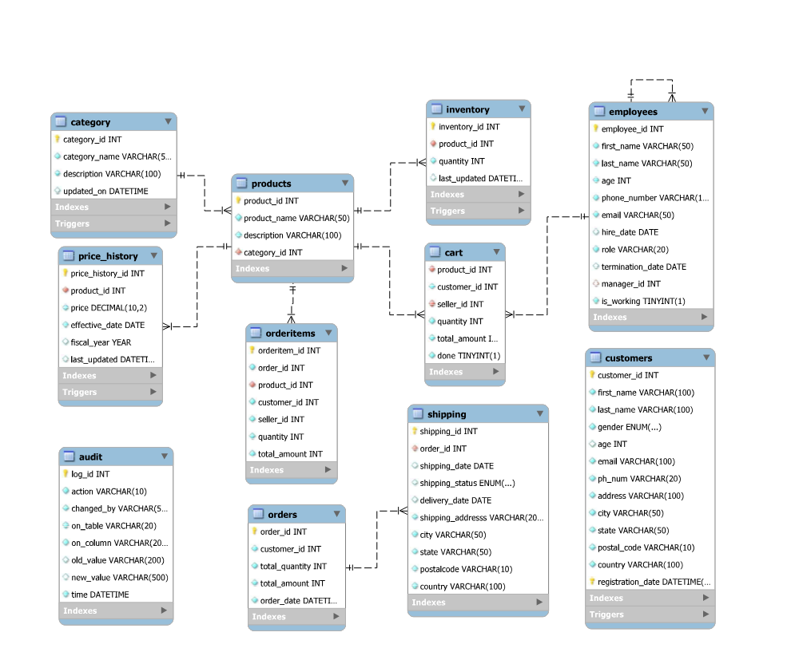

# Sales Order DB Architecture with ACID-Compliant Business Logic

## 📌 Project Overview

This project demonstrates a complete **end-to-end MySQL-based database system** for managing a sales order workflow. It includes core business logic such as customer registration, order placement, product inventory updates, and auditing — all built using **stored procedures, triggers, indexing**, and **ACID-compliant transactional control**.

## 🚀 Features

- ✅ Fully normalized MySQL schema (3NF) with customer, product, order, and audit tables
- ✅ Data validation logic for duplicate emails and phone numbers
- ✅ Dynamic procedure-based cart and order handling
- ✅ AFTER UPDATE trigger for logging changes in `OrderDetails`
- ✅ Partitioning on `registration_date` to support scalability
- ✅ Indexing on age, gender, and location for performance boost
- ✅ Transaction-safe operations with rollback support

## 🧠 Technologies Used

- **MySQL Workbench**
- **Jupyter Notebook (SQL via `%sql`)**
- **SQLAlchemy + PyMySQL (Python backend)**

## 🔄 Key Components

### 🔹 Stored Procedure: `insert_date_in_customers`
- Validates if the email or phone number is already in the system
- Applies default values to missing or invalid fields (like gender, age)
- Inserts a new customer record with current registration timestamp
- Logs action into an `audit` table with metadata

### 🔹 Trigger: `AFTER UPDATE` on `OrderDetails`
- Captures `OLD` and `NEW` values when changes happen
- Inserts change history into `audit_order_details`

### 🔹 ACID Compliance in Practice
- **Atomicity**: Every operation either completes or rolls back safely
- **Consistency**: All referential constraints and checks maintained
- **Isolation**: Uses default isolation level to prevent dirty reads
- **Durability**: Data is safely persisted using `COMMIT`

## 📊 Optimization Highlights
- Indexed `customer_id`, `city`, `state`, `gender`, `age` for optimized lookup
- Partitioned customer data by registration year for long-term scalability
- Prepared for scale-out workloads and BI integration

## ✅ Example Use Cases
- Insert customers using: `CALL insert_date_in_customers(...)`
- Validate business logic via test cases in Jupyter
- Track user-level DML actions via `audit` table

## 📚 Learning Outcomes
- Advanced procedure writing and trigger usage in MySQL
- Experience implementing real-world business rules using SQL
- Deepened understanding of transactions, indexing, and partitioning

---

> 🔍 *Built with a focus on real-world transactional use cases, data reliability, and database design best practices.*
